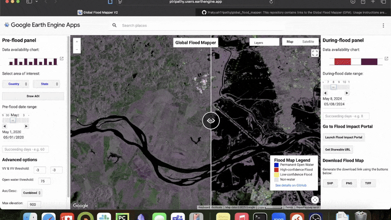
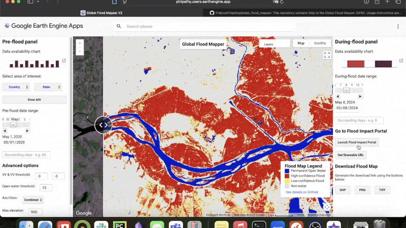

# Flood Deduction & Impact Assessment System

This repository contains the complete source code, operational workflows, and historical disaster validation benchmarks for the **Flood Deduction & Impact Assessment System** powered by Google Earth Engine (GEE) and Sentinel-1 Synthetic Aperture Radar (SAR) imagery.

The system performs near-real-time satellite flood extent extraction, terrain/seasonality filtering, inundation depth estimation, and socio-economic exposure analytics (population & land cover vulnerability).

---

### 🌊 Inundation Mapping Pipeline
The animated preview below demonstrates the interactive flood extraction and baseline swipe workflow:


### 📊 Disaster Impact Assessment Portal
The animated preview below demonstrates the socio-economic exposure analytics, population quantification, and land cover vulnerability breakdown:


> **Browser Note:** For the best performance and WebGL rendering of Earth Engine split-map panels, Google Chrome or Chromium-based browsers are recommended.

---

## ⚡ Core Capabilities & Algorithmic Pipeline

The **Flood Deduction & Impact Assessment System** enables rapid extraction of high-precision inundation footprints by selecting an Area of Interest (AOI) and comparing pre-event baseline and peak flood SAR backscatter:

- **Sentinel-1 GRD SAR Processing**: Dual-polarization ($\text{VV}$ & $\text{VH}$) backscatter calibration with Refined Lee speckle filtering.
- **Dynamic Z-Score Thresholding**: Statistical log-ratio difference computation (default `-3.0 dB`) to detect specular water reflections.
- **Topographic Terrain Masking**: HydroSHEDS / Copernicus DEM slope filtering (default `< 15°`) and elevation cutoff (default `900 m`) to remove shadow artifacts.
- **Permanent Water Masking**: JRC Global Surface Water seasonality filtering (default `75%`) to isolate genuine flood inundation.
- **Exposure & Impact Assessment**: Direct raster integration with **WorldPop** (affected population density) and **Dynamic World / Copernicus Land Cover** classification.
- **Multi-Format Export Pipeline**: One-click asynchronous export to Google Drive in **GeoTIFF** raster or ESRI **Shapefile (SHP)** formats.

---

## 💻 Source Code & Google Earth Engine Setup

The complete modular Earth Engine JavaScript scripts are available in [`source_code/`](./source_code):

1. Open the [Google Earth Engine Code Editor](https://code.earthengine.google.com/).
2. Run the modules directly:
   - [`source_code/gfm-v2.js`](./source_code/gfm-v2.js): Complete main application script with UI panels, dual map swipe view, analytics engine, and export pipelines.
   - [`source_code/countrystates.js`](./source_code/countrystates.js): Global administrative boundary dictionary module (FAO GAUL Level 1).

---

## 📖 Recommended Workflow & Tuning Manual
See [instructions/README.md](./instructions/README.md) for full step-by-step instructions:
- **Step 1**: Select Area of Interest (Country/State dropdown or interactive "Draw AOI" bounding box)
- **Step 2**: Select pre-flood baseline date range (1–2 months prior, 60-day baseline recommended)
- **Step 3**: Select during-flood peak disaster date range
- **Step 4**: Swipe between pre-flood and during-flood SAR backscatter to verify water change
- **Step 5**: Export flood footprint as GeoTIFF or Shapefile (SHP)
- **Advanced Calibration**: Tuning $\text{Z}_{\text{VV}}$, $\text{Z}_{\text{VH}}$, permanent water seasonality, and DEM slope parameters
- **Impact Assessment Portal**: Analyzing affected population counts and land cover disruption

---

## 🌍 Global Benchmark Disaster Case Studies
Explore validated historical flood events with exact satellite parameters, dates, and high-resolution results in [examples/README.md](./examples/README.md):

- **2021**: [Pahang, Malaysia](./examples/2021)
- **2020**: [Bihar, India](./examples/2020) | [Huế, Vietnam](./examples/2020) | [Cambodia](./examples/2020)
- **2019**: [Assam, India](./examples/2019) | [Beira, Mozambique](./examples/2019) | [Bahamas](./examples/2019)
- **2018**: [Kauai, Hawaii, USA](./examples/2018)
- **2017**: [Houston, Texas, USA](./examples/2017) | [Sylhet, Bangladesh](./examples/2017)
- **2016**: [Roscommon, Ireland](./examples/2016)
- **2015**: [England, UK](./examples/2015) | [Greece](./examples/2015)
- **Multi-Year Temporal Study**: [Bihar Inundation Dynamics 2017–2020](./examples/BiharTemporal)

---

## 📁 Repository Structure

```
├── examples/             # Verified global flood case studies (2015-2021)
│   ├── 2015/ ... 2021/   # Per-year documentation, parameters, and result imagery
│   └── BiharTemporal/    # Temporal multi-year inundation analysis (2017-2020)
├── instructions/         # Comprehensive user manual, calibration guide & troubleshooting
│   └── README.md
├── media/                # Visual assets, interface GIFs, legends, and result maps
├── source_code/          # Earth Engine source code modules
│   ├── countrystates.js  # Administrative boundary lookup module
│   ├── gfm-v2.js         # Flood Deduction core algorithm & UI application script
│   └── README.md
└── README.md             # Project documentation
```

---

## 📚 Scientific References & Methodology

```bibtex
@article{tripathy2022global,
  title={Global Flood Mapper: a novel Google Earth Engine application for rapid flood mapping using Sentinel-1 SAR},
  author={Tripathy, Pratyush and Malladi, Teja},
  journal={Natural Hazards},
  volume={114},
  number={2},
  pages={1251--1271},
  year={2022},
  publisher={Springer},
  doi={10.1007/s11069-022-05428-2}
}
```

```bibtex
@inproceedings{tripathy2021global,
  title={Global Flood Mapper: Democratising open EO resources for flood mapping},
  author={Tripathy, Pratyush and Malladi, Teja},
  booktitle={EGU General Assembly Conference Abstracts},
  pages={EGU21--16194},
  year={2021},
  doi={10.5194/egusphere-egu21-16194}
}
```
