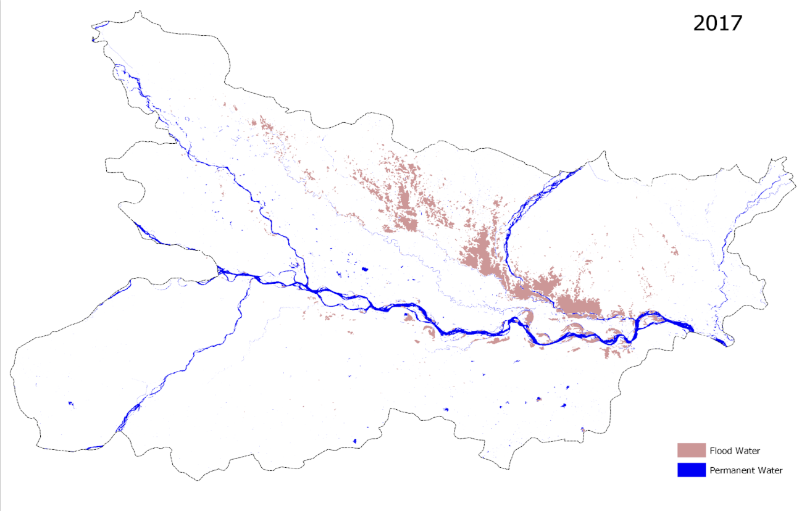
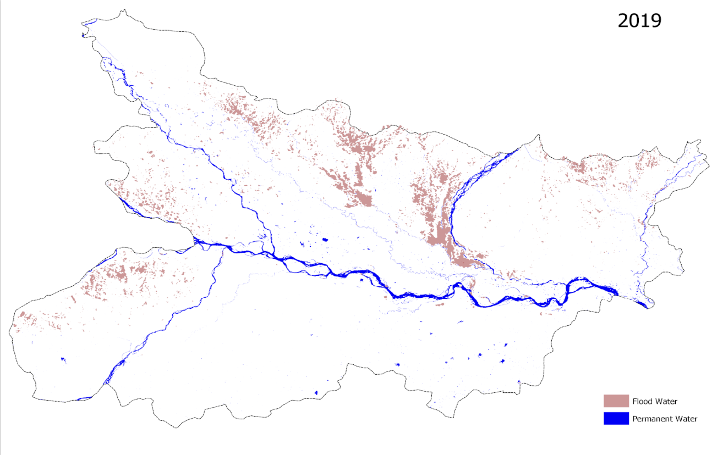
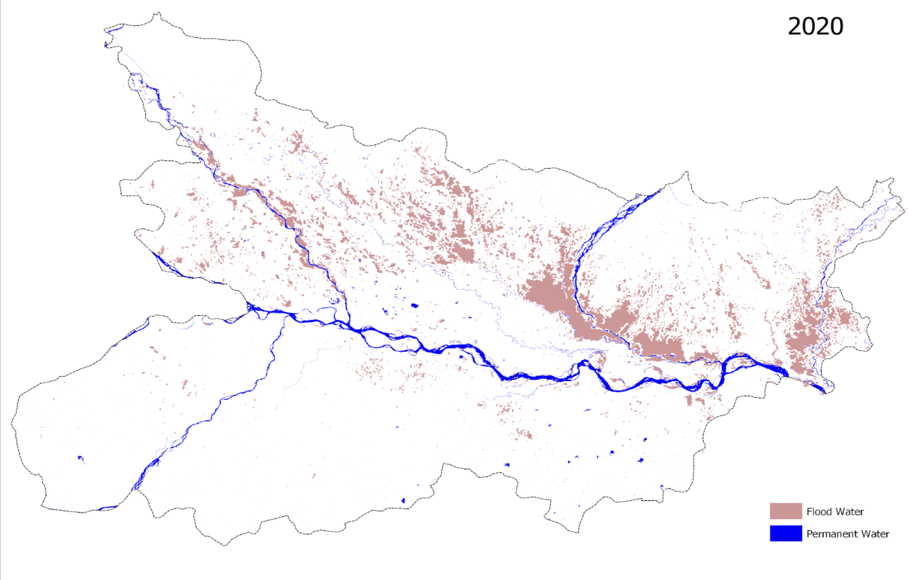
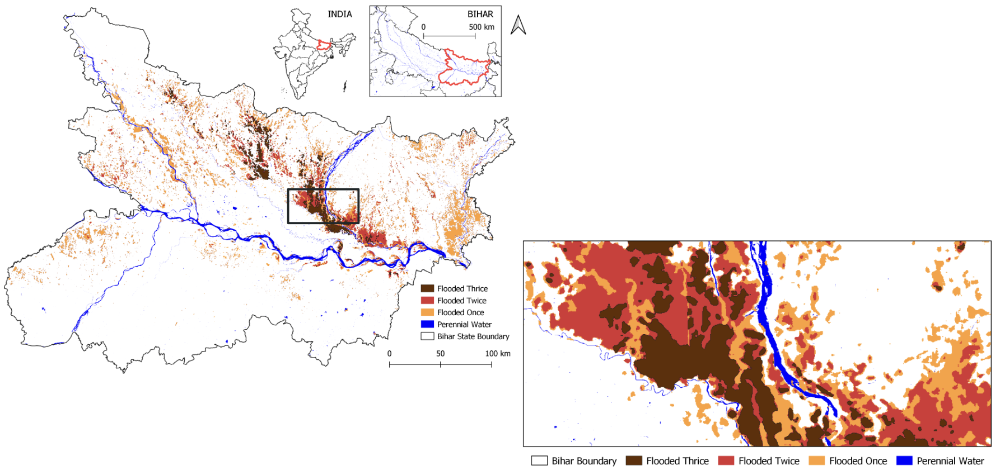

# Historical Flood Disaster Benchmarks & Validation Cases

This directory contains global historical flood benchmarks extracted and validated using the **Flood Deduction & Impact Assessment System**:

---

## 📅 Disaster Case Studies by Year

### 🔹 [Floods in 2021](./2021)
1. **Pahang, Malaysia** — Monsoon river basin overflow and localized flooding

### 🔹 [Floods in 2020](./2020)
1. **Bihar, India** — Severe monsoon inundation across the Gangetic plains
2. **Huế, Vietnam** — Typhoon-induced heavy precipitation and coastal inundation
3. **Cambodia** — Tonlé Sap flash flooding and seasonal inundation

### 🔹 [Floods in 2019](./2019)
1. **Assam, India** — Brahmaputra river basin monsoon inundation
2. **Beira, Mozambique** — Cyclone Idai landfall and coastal surge
3. **Bahamas** — Hurricane Dorian storm surge inundation

### 🔹 [Floods in 2018](./2018)
1. **Kauai, Hawaii, USA** — Record-breaking tropical downpours and flash floods

### 🔹 [Floods in 2017](./2017)
1. **Houston, Texas, USA** — Hurricane Harvey catastrophic urban flooding
2. **Sylhet, Bangladesh** — Flash flood inundation across low-lying Haor wetlands

### 🔹 [Floods in 2016](./2016)
1. **Roscommon, Ireland** — Shannon river winter storm surge and karst turlough flooding

### 🔹 [Floods in 2015](./2015)
1. **England, UK** — Storm Desmond and winter cyclone flooding
2. **Anatoliki Makedonia Kai Thraki, Greece** — Evros river transboundary flooding

---

## 📊 Temporal Flood Dynamics: Bihar (2017 – 2020)

 
 
 
 
