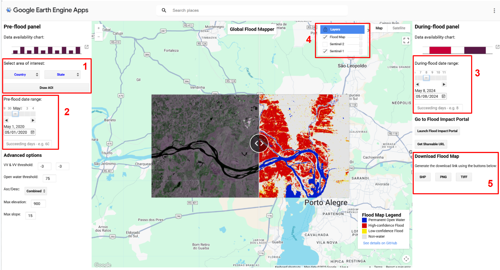
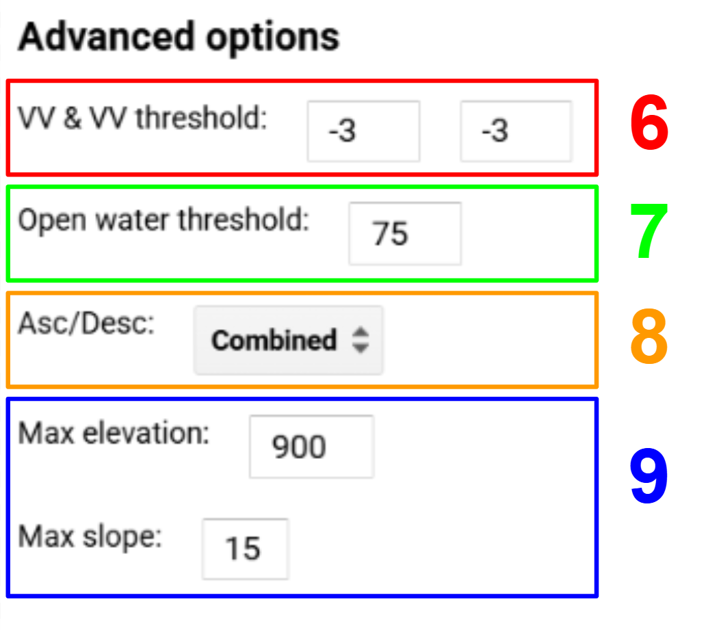
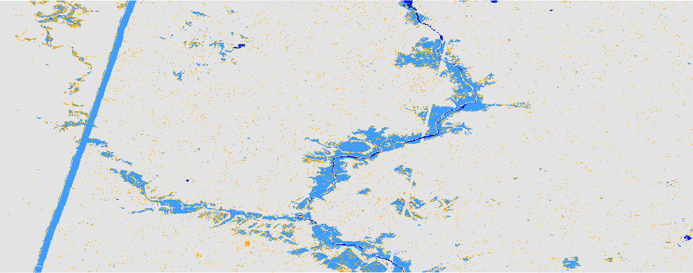
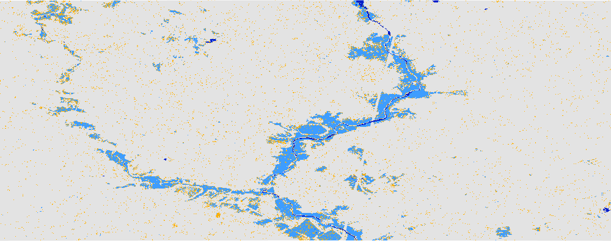
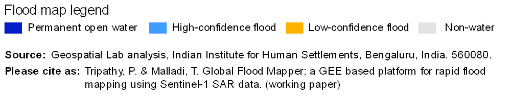
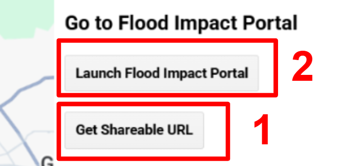
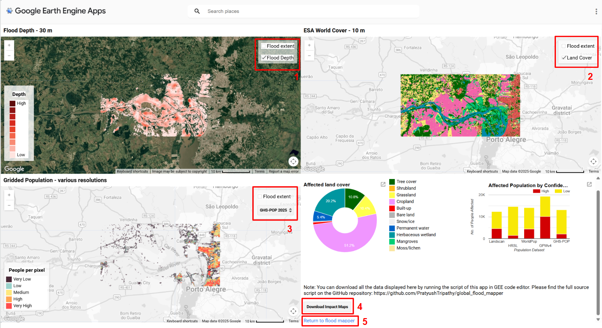

# Operational Instructions & Parameter Calibration Guide  

### Recommended Workflow to Generate Flood Maps:
1. **Select Area of Interest (AOI)**: Choose your region via the country and state dropdown menus, or define a custom bounding box by clicking **"Draw AOI"**.  
2. **Pre-Flood Baseline Date Range**: Select a baseline period 1–2 months prior to the flood event using the pre-flood date slider and succeeding days count (default: 60 days).  
3. **During-Flood Peak Date Range**: Specify the peak flood observation window. To minimize temporal mixing, choose the tightest range that fully covers the target area with SAR passes.  
4. **Baseline Backscatter Validation**: Turn off the flood map layer temporarily and swipe between pre-flood and during-flood SAR backscatter images. Specular open water will show a prominent decrease in radar backscatter (darker pixels). Once verified, re-enable the flood extent layer.  
5. **Export Inundation Products**: Download the extracted flood extent directly as GeoTIFF, Shapefile (SHP), or high-resolution PNG.  

> **Note on Export Formats:** Minor spatial differences may occur between PNG, GeoTIFF, and Shapefile outputs due to differing export pipelines in Earth Engine. The PNG is rendered at a fixed preview resolution, GeoTIFF exports at your chosen ground pixel resolution, and Shapefile vectorization operates directly on raw classified raster pixels via `reduceToVectors`.

---

## Advanced Parameter Tuning  

6. **$\text{Z}_{\text{VV}}$ and $\text{Z}_{\text{VH}}$ Difference Thresholds**: Calibrate statistical log-ratio thresholds (default `-3.0 dB`). Adjusting closer to `0 dB` captures fainter water signals but may increase false alarms in low-roughness soil.   
7. **Permanent Water Threshold (POW)**: Controls JRC Global Surface Water seasonality filtering (valid range: 0–100%, default: 75%). Prevents permanent lakes and rivers from being misidentified as event floodwater.  
8. **Orbit Pass Selection**: Select `Ascending`, `Descending`, or `Combined` based on satellite track geometry. For rapid flash floods, processing ascending and descending passes separately is recommended.  
9. **Topographic Masking (Elevation & Slope)**: To eliminate radar shadow and layover false positives on steep terrain, limit maximum slope (default: `15°`) and maximum elevation (default: `900 m`).

---

## Troubleshooting & Common Pitfalls  

1. **Linear Swath Boundary Artifacts**: If a straight linear boundary appears across the flood map, it corresponds to a SAR swath orbit edge. Adjust the during-flood date window by 1–2 days to capture the full overlapping orbit swath.

	 
 

---

## Disaster Impact Assessment Portal  

1. **Shareable URL Configuration**: Click **"Get Shareable URL"** to generate a deep link preserving all current AOI and algorithmic threshold parameters.
2. **Launch Portal**: Click **"Launch Flood Impact Portal"** to initiate asynchronous raster calculations for water depth, affected population, and land cover damage breakdown.

3. **Inundation Depth Map**: Toggle water depth gradient visualization and flood boundaries.
4. **Land Cover Exposure**: Inspect affected Copernicus / Dynamic World land cover classes (urban, agriculture, vegetation).
5. **Gridded Population Exposure**: Select between WorldPop and JRC Human Settlement datasets to quantify affected resident counts per district.
6. **Return Navigation**: Click **"Return to flood mapper"** to switch back to the main interactive dual-map viewer.
